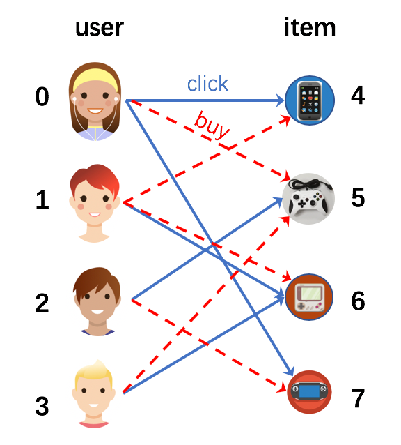

## Introduction

In real world, there exists many graphs contain multiple types of nodes and edges, which we call them Heterogeneous Graphs. Obviously, heterogenous graphs are more complex than homogeneous graphs. 

To deal with such heterogeneous graphs, PGL develops a graph framework to support graph neural network computations and meta-path-based sampling on heterogenous graph.

The goal of this tutorial:
* example of heterogenous graph data;
* Understand how PGL supports computations in heterogenous graph;
* Using PGL to implement a simple heterogenous graph neural network model to classfiy a particular type of node in a heterogenous graph network.

## Example of heterogenous graph

There are a lot of graph data that consists of edges and nodes of multiple types. For example, **e-commerce network** is very common heterogenous graph in real world. It contains at least two types of nodes (user and item) and two types of edges (buy and click). 

The following figure depicts several users click or buy some items. This graph has two types of nodes corresponding to "user" and "item". It also contain two types of edge "buy" and "click".



## Creating a heterogenous graph with PGL 

In heterogenous graph, there exists multiple edges, so we should distinguish them. In PGL, the edges are built in below format:


```python
edges = {
        'click': [(0, 4), (0, 7), (1, 6), (2, 5), (3, 6)],
        'buy': [(0, 5), (1, 4), (1, 6), (2, 7), (3, 5)],
    }

clicked = [(j, i) for i, j in edges['click']]
bought = [(j, i) for i, j in edges['buy']]
edges['clicked'] = clicked
edges['bought'] = bought
```

In heterogenous graph, nodes are also of different types. Therefore, you need to mark the type of each node, the format of the node type is as follows:


```python
node_types = [(0, 'user'), (1, 'user'), (2, 'user'), (3, 'user'), (4, 'item'), 
             (5, 'item'),(6, 'item'), (7, 'item')]
```

Because of the different types of edges, edge features also need to be separated by different types.


```python
import numpy as np
import paddle
import paddle.nn as nn
import pgl
seed = 0
np.random.seed(0)
paddle.seed(0)

num_nodes = len(node_types)

node_features = {'features': np.random.randn(num_nodes, 8).astype("float32")}

labels = np.array([0, 1, 0, 1, 0, 1, 1, 0])
```

Now, we can build a heterogenous graph by using PGL.


```python
g = pgl.HeterGraph(edges=edges, 
                   node_types=node_types,
                   node_feat=node_features)
```

## MessagePassing on Heterogeneous Graph

After building the heterogeneous graph, we can easily carry out the message passing mode. In this case, we have two different types of edges.


```python
class HeterMessagePassingLayer(nn.Layer):
    def __init__(self, in_dim, out_dim, etypes):
        super(HeterMessagePassingLayer, self).__init__()
        self.in_dim = in_dim
        self.out_dim = out_dim
        self.etypes = etypes
        
        self.weight = []
        for i in range(len(self.etypes)):
            self.weight.append(
                 self.create_parameter(shape=[self.in_dim, self.out_dim]))
        
    def forward(self, graph, feat):
        def send_func(src_feat, dst_feat, edge_feat):
            return src_feat
        
        def recv_func(msg):
            return msg.reduce_mean(msg["h"])
        
        feat_list = []
        for idx, etype in enumerate(self.etypes):
            h = paddle.matmul(feat, self.weight[idx])
            msg = graph[etype].send(send_func, src_feat={"h": h})
            h = graph[etype].recv(recv_func, msg)
            feat_list.append(h)
            
        h = paddle.stack(feat_list, axis=0)
        h = paddle.sum(h, axis=0)
        
        return h
        
```

Create a simple GNN by stacking two HeterMessagePassingLayer.


```python
class HeterGNN(nn.Layer):
    def __init__(self, in_dim, hidden_size, etypes, num_class):
        super(HeterGNN, self).__init__()
        self.in_dim = in_dim
        self.hidden_size = hidden_size
        self.etypes = etypes
        self.num_class = num_class
        
        self.layers = nn.LayerList()
        self.layers.append(
                HeterMessagePassingLayer(self.in_dim, self.hidden_size, self.etypes))
        self.layers.append(
                HeterMessagePassingLayer(self.hidden_size, self.hidden_size, self.etypes))
        
        self.linear = nn.Linear(self.hidden_size, self.num_class)
        
    def forward(self, graph, feat):
        h = feat
        for i in range(len(self.layers)):
            h = self.layers[i](graph, h)
            
        logits = self.linear(h)
        
        return logits
        
```

## Training


```python
model = HeterGNN(8, 8, g.edge_types, 2)

criterion = paddle.nn.loss.CrossEntropyLoss()

optim = paddle.optimizer.Adam(learning_rate=0.05, 
                            parameters=model.parameters())

g.tensor()
labels = paddle.to_tensor(labels)
for epoch in range(10):
    #print(g.node_feat["features"])
    logits = model(g, g.node_feat["features"])
    loss = criterion(logits, labels)
    loss.backward()
    optim.step()
    optim.clear_grad()
    
    print("epoch: %s | loss: %.4f" % (epoch, loss.numpy()[0]))
```

    epoch: 0 | loss: 1.3536
    epoch: 1 | loss: 1.1593
    epoch: 2 | loss: 0.9971
    epoch: 3 | loss: 0.8670
    epoch: 4 | loss: 0.7591
    epoch: 5 | loss: 0.6629
    epoch: 6 | loss: 0.5773
    epoch: 7 | loss: 0.5130
    epoch: 8 | loss: 0.4782
    epoch: 9 | loss: 0.4551
